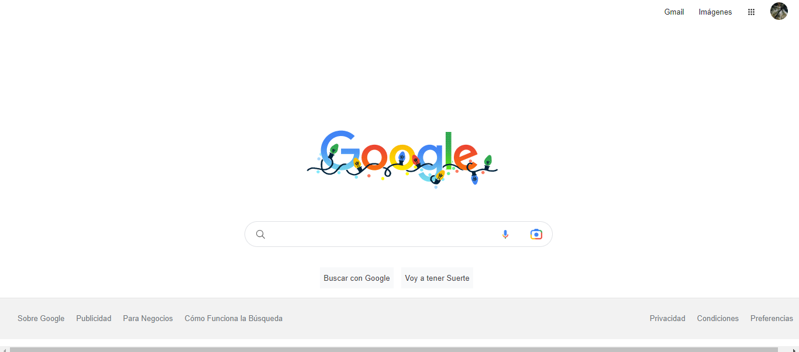

# Clon de el buscador de Google

Proyecto realizado como práctica del bootcamp de Tecnolochicas Proyectos.

## ¿Qué construí?

En este proyecto tuve como proposito construir la clonación de la interfaz del navegador de Google.
Contine los siguientes elementos:

* Header.
* Main.
* Footer.

## ¿Qué tecnologías utilicé?

## Mi Objetivo:
Aprender a utilizar los lenguajes y las etiquetas principales de CSS y HTML.

## Mira aquí mi proyecto:
[Clonación de Google.](https://googleclon-valeria-vazquezs-projects.vercel.app/)

## 🔗 Más:

